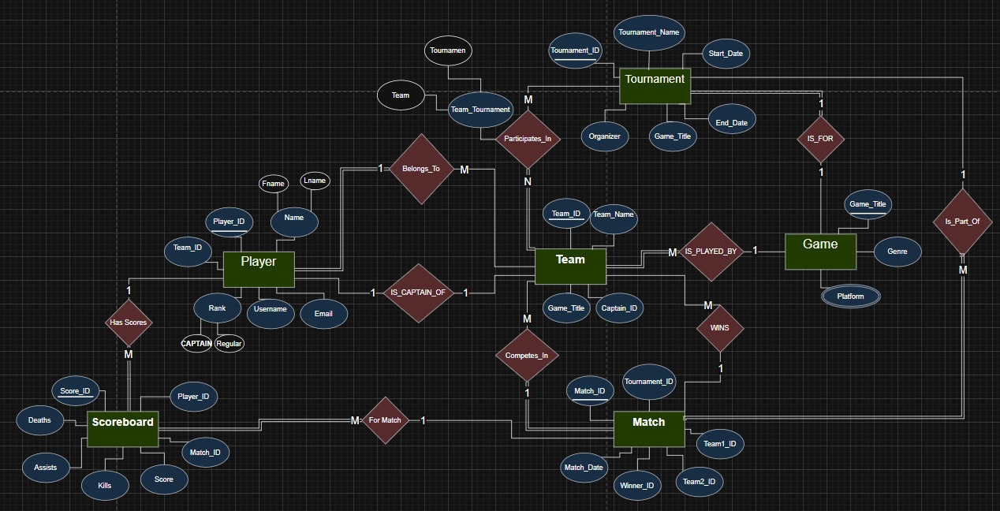
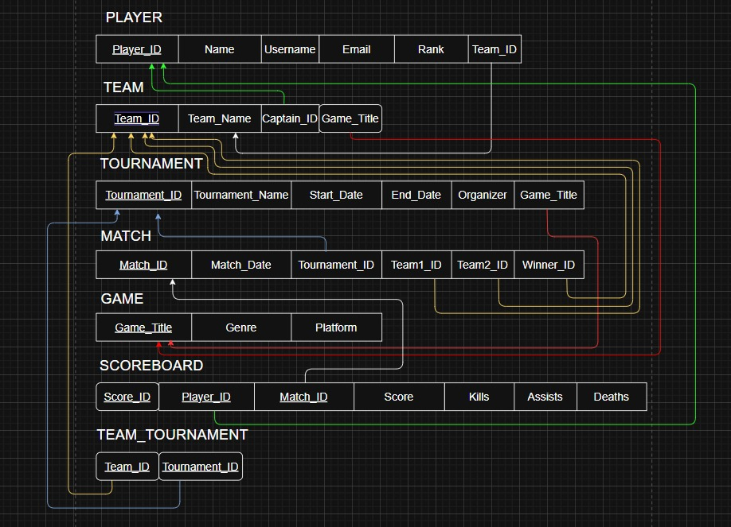

# E-sports Platform Database System 🎮

## Project Overview
[cite_start]A comprehensive database solution designed for an **E-sports Management Platform**[cite: 5]. [cite_start]This system manages players, teams, games, and tournaments, with a focus on data integrity, normalization (3NF), and advanced SQL analytics[cite: 9, 10].

## Key Features
* [cite_start]**ER Modeling:** Detailed Entity-Relationship Diagram representing complex gaming ecosystems[cite: 75, 76].
* [cite_start]**Database Normalization:** Fully optimized to **3rd Normal Form (3NF)** to ensure zero redundancy[cite: 104, 105].
* [cite_start]**Complex SQL Analytics:** Implementation of Relational Algebra operations through advanced SQL queries such as Joins and Aggregations[cite: 255, 309].
* [cite_start]**Data Integrity:** Strict enforcement of Primary Keys, Foreign Keys, and Value Constraints like score and date validation [cite: 58-70].

## 📊 Database Design Diagrams
Visualize the structural design of the database, from conceptual ERD to the relational implementation.

### 1. Entity-Relationship Diagram (ERD)

### 2. Relational Schema

## 📂 Repository Structure
* [cite_start]**`SQL_Scripts/`**: Contains DDL (Schema), DML (Data), and DQL (Analytics) [cite: 44-56].
* **`Diagrams/`**: ER Diagrams and Relational Schema visualizations[cite: 75, 93].
* [cite_start]**`Documentation/`**: Full project phases and normalization reports[cite: 4, 72].

## 🛠 Tech Stack
* **Language:** SQL
* **Tools:** Git, GitHub
* [cite_start]**Methodology:** Relational Algebra, 1NF/2NF/3NF Normalization[cite: 104, 247].

---
### Academic Context
* **University:** King Abdulaziz University (FCIT) [cite: 1, 2, 3]
* [cite_start]**Course:** CPIT-240 (Database Systems) [cite: 4]
* [cite_start]**Term:** Spring 2025 [cite: 7]
* **Lead Developer:** Munther Salim Alfarsi [cite: 6]
  
